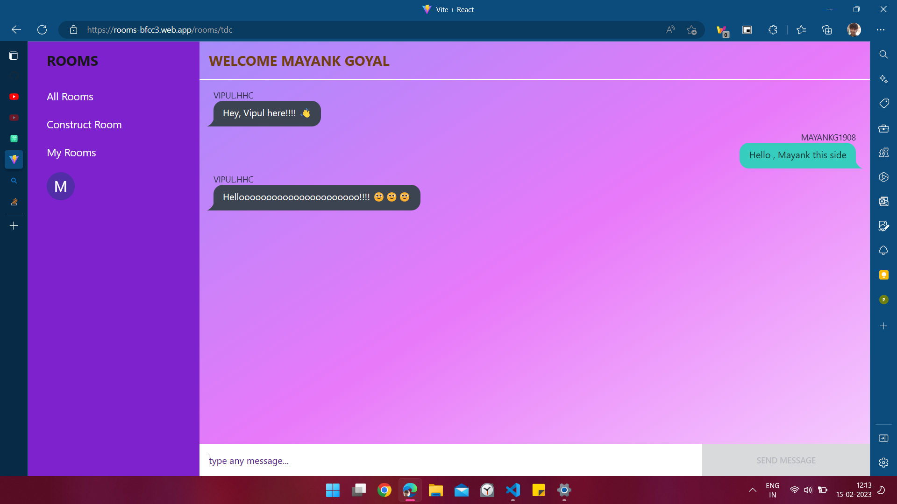
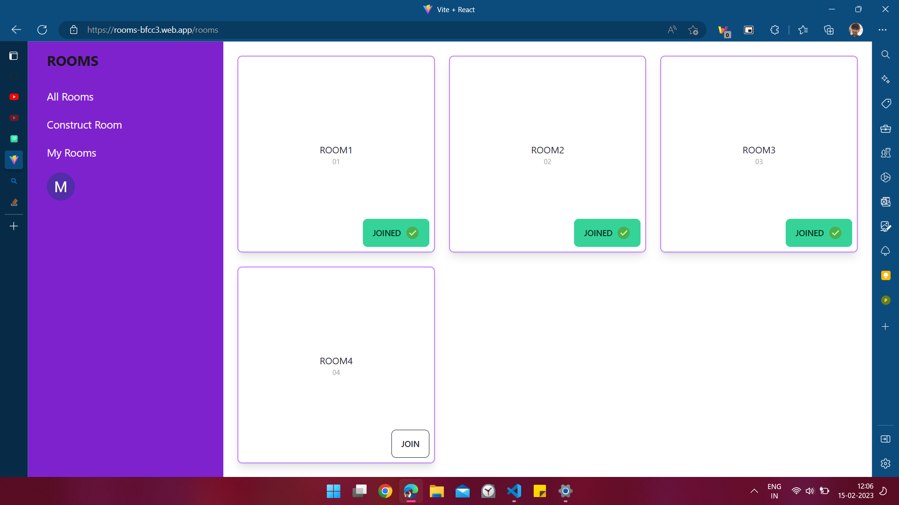

# Rooms web app

LIVE: https://rooms-bfcc3.web.app/rooms/tdc

## Short Description

The room web app is primarily used for realtime chatting
based on the group of people having same interest.

## Features
- User can login and message will be sent as per his username which is unique for each user. 
- User can construct a new room and room name can be same but there must be unique room code.
- User can join a room and can start community chat
- Can delete rooms those constructed by user himself.

## Tech stack used

 
 
 
 
 

## Demo

